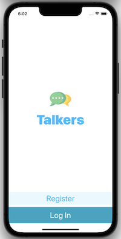
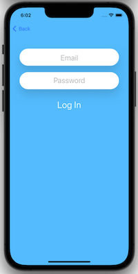
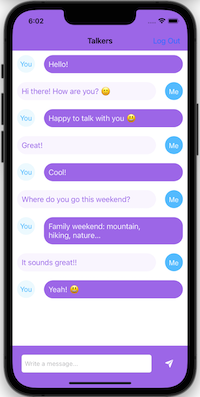

#  TrendyFilms

<h4 align="center">A iOS chat app</h4>

  •<a href="#key-features">Key Features</a>
  •<a href="#how-to-use">How To Use</a> 

## Code Quality Status
 
 
 
 
  

## Key Features

* UIKit
* MVC
* Structs
* Classes
* Optionals
* Extensions
* Closures
* Error handling
* TableView
* Firebase
* Registration
* Authorization

## How To Use
The app allow you register and save your user data in Firebase. After that, you can login and chat with a friend registered too.